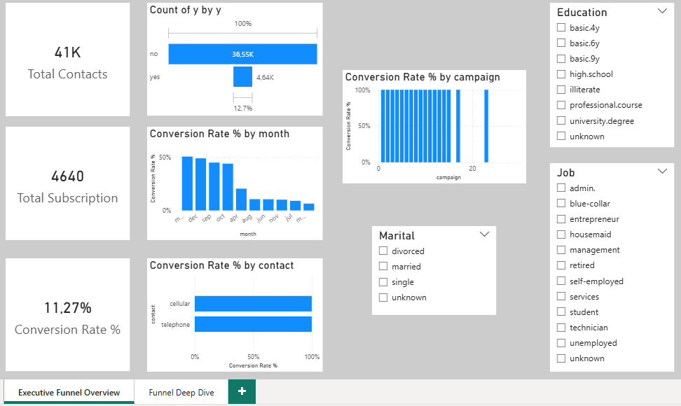
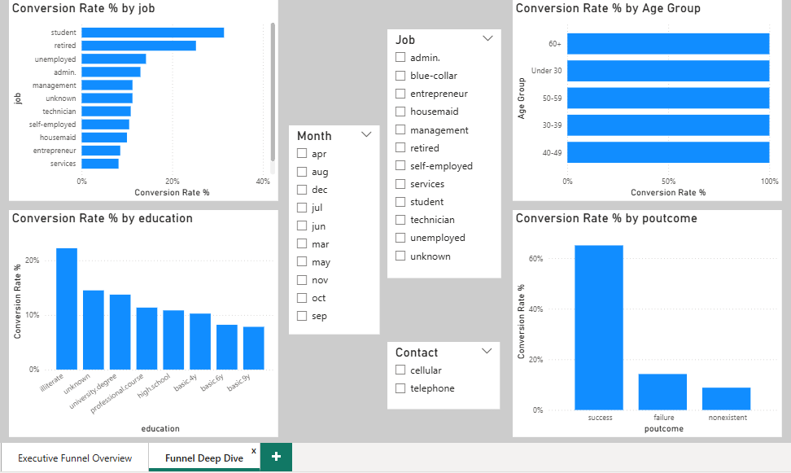

# FUTURE_DS_03 – Marketing Funnel & Conversion Performance Analysis

## 📌 Project Overview
This project analyzes marketing campaign performance and customer conversion patterns using a banking marketing dataset. The objective was to evaluate funnel performance, identify drop-off points, and recommend strategies to improve conversion rates.

The dataset contains over 41,000 marketing contact records.

---

## 🛠 Tools Used
- Power BI
- DAX (Data Analysis Expressions)
- Power Query (Data Cleaning)

---

## 📊 Key Metrics

- Total Contacts: 41,188
- Total Subscriptions: 4,640
- Overall Conversion Rate: 11.27%

---

## 📈 Analysis Performed

### Executive Funnel Overview
- Funnel visualization (Contact → Subscription)
- Conversion rate by month
- Conversion rate by contact type
- Conversion rate by campaign attempts

### Funnel Deep Dive
- Conversion rate by job segment
- Conversion rate by education level
- Conversion rate by age group
- Conversion rate by previous campaign outcome
- Interactive slicers for segmentation analysis

---

## 🔍 Key Insights

- Overall campaign conversion rate is 11.27%.
- Customers with previous successful campaign outcomes show significantly higher conversion probability.
- Conversion varies by month, indicating seasonal performance trends.
- Certain job categories (e.g., students and retirees) demonstrate higher subscription likelihood.
- Conversion rates differ across education levels.
- Excessive campaign attempts do not always increase conversion, suggesting diminishing returns.

---

## 💡 Business Recommendations

- Retarget customers with previously successful campaign history.
- Focus marketing budget on high-performing months.
- Develop targeted campaigns for high-converting demographic segments.
- Optimize contact strategy to avoid diminishing returns from repeated attempts.
- Improve messaging for low-conversion segments.

---

## 📷 Dashboard Preview

### Executive Funnel Overview

### Funnel Deep Dive

---

## 🚀 Project Outcome

This project demonstrates the ability to:
- Perform funnel and conversion analysis
- Measure marketing performance impact
- Identify drop-off patterns
- Generate revenue-focused business recommendations

---

📎 Author: Tshiamo  
Data Science & Analytics Intern
